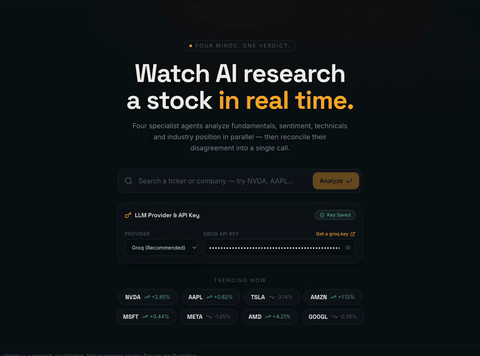

# Verdict — Multi-Agent Financial Due Diligence

> **Four AI agents analyze a stock in parallel while you watch the verdict form in real time. Fundamentals, sentiment, technicals and industry context — reconciled into one call.**

Verdikt is a full-stack multi-agent system for AI-powered stock research. It spins up a **team of four specialist analyst agents** (fundamentals, sentiment, industry, technical), has them independently research a ticker using real market-data tools, detects genuine disagreement between their stances, and hands their findings to a **Lead Synthesizer** that produces a single, compliant verdict — **Buy / Accumulate / Hold / Watch / Sell** — with a confidence score.

The entire deliberation is streamed live to the frontend over Server-Sent Events: you watch each agent think, run tools, report findings, clash, and reconcile — all in a cinematic dark-mode UI built with Next.js and Motion.

---

## Table of Contents

- [Demo Video](#demo-video)
- [Key Features](#key-features)
- [How It Works](#how-it-works)
- [System Architecture](#system-architecture)
- [The Agent Team](#the-agent-team)
- [Guardrails & Safety](#guardrails--safety)
- [Scoring Methodology](#scoring-methodology)
- [Tech Stack](#tech-stack)
- [Project Structure](#project-structure)
- [Getting Started](#getting-started)
  - [Prerequisites](#prerequisites)
  - [1. Backend Setup](#1-backend-setup)
  - [2. Frontend Setup](#2-frontend-setup)
  - [3. Run with Docker](#3-run-with-docker)
- [API Reference](#api-reference)
  - [`POST /analyze`](#post-analyze)
  - [SSE Event Stream](#sse-event-stream)
  - [Report Payload Shape](#report-payload-shape)
- [Configuration Reference](#configuration-reference)
- [Testing](#testing)
- [Deployment Notes](#deployment-notes)
- [Limitations & Roadmap](#limitations--roadmap)
- [Disclaimer](#disclaimer)
- [License](#license)

---

## Demo Video



*It walks through: entering a ticker (e.g. `AAPL` or `RELIANCE`), watching the four agents deliberate live on the pulse ring, the agent-vs-agent disagreement view, and the final verdict report.*

---

## Key Features

- **Multi-agent orchestration with LangGraph** — a cyclic, stateful supervisor graph that routes work between specialist agents and the synthesizer.
- **Bring-your-own-LLM** — the app works with **OpenAI (GPT-4o-mini)**, **Groq (gpt-oss-20b)**, or **Gemini (gemini-1.5-flash)**; you supply the API key at runtime in the UI. No backend key required.
- **Real market data, not hallucinations** — yfinance fundamentals, Twelve Data / Finnhub technical price feeds, Google News RSS + DuckDuckGo news for sentiment, Finnhub company profiles + web search for industry context.
- **Indian & US market support** — auto-detects exchange suffixes (`.NS` → NSE, `.BO` → BSE) so tickers like `RELIANCE.NS` and `AAPL` both work; currencies are displayed correctly (`$`, `₹`, `€`, …).
- **Live streaming deliberation** — every agent run, tool call, finding, and synthesis step is streamed to the UI via SSE with a real-time terminal, per-agent status cards, and a central pulse ring.
- **Deterministic disagreement detection** — agent stances are computed from real evidence, and if the bull/bear split is genuine but the synthesizer missed it, the backend builds the debate from the most opposed pair, quoting their actual analyses.
- **Evidence-based agent scores** — no hardcoded numbers: fundamentals score from FCF/debt/margins/ROE, sentiment from keyword classification, industry from keyword balance, technical from signal-ratio math.
- **Three layers of guardrails** — input (prompt-injection/SQL/XSS/length validation), execution (circuit breakers so one failing agent can't crash the pipeline), and output (verdict taxonomy enforcement, confidence clamping, compliance-claim sanitization, mandatory disclaimer).
- **Compliance-aware output** — prohibited financial claims ("guaranteed profit", "zero risk") are auto-rewritten, verdict signals are clamped to a strict taxonomy, and every report carries a mandatory financial disclaimer.
- **Cinematic dark-mode UI** — animated search → live deliberation → verdict flow built with Next.js 16, React 19, Motion, and Tailwind CSS 4.

---

## How It Works

### The end-to-end flow

```
User types a ticker
        │
        ▼
┌─────────────────────────────┐
│  INPUT GUARDRAILS           │  validate ticker format + block injection/SQL/XSS
│  (FastAPI layer)            │  validate provider + API-key format
└─────────────────────────────┘
        │
        ▼
┌──────────────────────────────────────────────────────────┐
│                   LANGGRAPH STATE GRAPH                  │
│                                                          │
│  ┌────────────┐   conditional routing   ┌──────────────┐ │
│  │ SUPERVISOR │ ───────────────────────▶│  ANALYSTS    │ │
│  │  (router)  │ ◀───────────────────────│ (4 agents)   │ │
│  └────────────┘   loop back when done   └──────────────┘ │
│        │                                                 │
│        │ when all agents complete ("FINISH")             │
│        ▼                                                 │
│  ┌────────────┐                                          │
│  │SYNTHESIZER │  final JSON report → output guardrails   │
│  └────────────┘                                          │
└──────────────────────────────────────────────────────────┘
        │
        ▼
  SSE stream: supervisor_start → agent_queued/running/log/complete
  (×4 agents) → synthesis_start/log → report_ready → done
        │
        ▼
  Frontend converts payload → animated verdict report
  (agent findings, disagreement debate, bull/bear case, verdict meter)
```

### Step by step

1. **Input validation** — The FastAPI endpoint (`POST /analyze`) runs two input guardrails before touching the graph: ticker sanitization (length, charset, injection patterns) and provider/key format checks. Violations halt the pipeline immediately with a guardrail error event.

2. **Supervisor routing** — A LangGraph `StateGraph` starts at the `Supervisor` node, which inspects the shared state flags (`fundamentals_done`, `sentiment_done`, …) and routes to the next unfinished analyst. Each analyst runs, writes its analysis into state, and loops **back to the supervisor** — this cycle continues until all four analysts have reported, at which point the supervisor routes `FINISH`.

3. **Specialist agents** — Each analyst invokes its data tool(s), then prompts its LLM (via your API key) with a domain-specific system prompt from `backend/prompts/`:
   - **Fundamentals Analyst** → `yfinance` financials (revenue, net income, FCF, D/E, margins, ROE, P/E) with financial-statement and web-search fallbacks.
   - **Sentiment Analyst** → recent news headlines from Google News RSS / Yahoo Finance / DuckDuckGo News.
   - **Industry Analyst** → Finnhub company profile (+ yfinance fallback), business summary, macro factors, and competitive landscape via web search.
   - **Technical Analyst** → 1 year of daily OHLCV (yfinance → Twelve Data → Finnhub fallback chain) and computes SMA20/50/200, RSI-14, MACD, performance windows, 52-week range.

4. **Execution guardrails** — Every agent node is wrapped in a **circuit breaker**: if the LLM call or tool throws, the node records a partial-failure notice, marks itself done, and the pipeline continues instead of crashing.

5. **Synthesis** — The Lead Synthesizer receives all four analyses **plus the deterministically computed agent stances** and produces a strict JSON verdict (`signal`, `headline`, `reasoning`, `confidence`) and a disagreement block describing any genuine bull/bear clash between agents.

6. **Output guardrails** — The report builder:
   - recomputes agent scores/stances from real evidence,
   - enforces the verdict taxonomy (`Buy | Accumulate | Hold | Watch | Sell`), clamps confidence to `[0, 100]`,
   - sanitizes compliance claims, and appends the mandatory financial disclaimer.

7. **Streaming** — Everything is streamed to the client as typed SSE events (see [SSE Event Stream](#sse-event-stream)); the frontend renders live agent status, a streaming terminal, and finally the animated verdict report.

---

## System Architecture

### Backend (`backend/`)

| Layer | Module | Responsibility |
|---|---|---|
| API | `main.py` | FastAPI app, CORS, SSE streaming, report assembly, guardrail enforcement at the endpoint |
| Orchestration | `graph/workflow.py` | LangGraph `StateGraph` — supervisor ↔ analyst cycle, entry point, conditional edges |
| Graph state | `graph/state.py` | Typed `DueDiligenceState` — message history, ticker, provider, completion flags, per-agent analyses |
| Nodes | `graph/nodes.py` | Supervisor + 4 analyst nodes + synthesizer; dynamic LLM factory (OpenAI/Groq/Gemini); circuit-breaker wrapping |
| Tools | `tools/fundamentals.py` | Fundamentals: yfinance `info` → financial statements → DDG search fallback; number formatting (T/B/M) |
| Tools | `tools/technical.py` | Technicals: OHLCV fetch chain (yfinance → Twelve Data → Finnhub), SMA/RSI/MACD math, signal ratio & trend |
| Tools | `tools/search.py` | News sentiment (Google News RSS → yfinance news → DDG news) + industry context (Finnhub profile2, DDG search) |
| Tools | `tools/ticker_utils.py` | Ticker resolution, `.NS`/`.BO` exchange detection, currency symbols, yfinance retries |
| Tools | `tools/scoring.py` | Deterministic evidence-based stance/score extraction for all four agents |
| Guardrails | `guardrails/input_guardrails.py` | Ticker validation + injection/SQL/XSS pattern blocking + key/provider validation |
| Guardrails | `guardrails/execution_guardrails.py` | Circuit-breaker wrapper for every graph node |
| Guardrails | `guardrails/output_guardrails.py` | JSON cleaning, verdict taxonomy, confidence clamp, compliance sanitization, disclaimer |
| Prompts | `prompts/*.txt` | System prompts for each analyst + synthesizer |
| Deploy | `Dockerfile`, `requirements.txt` | Containerized FastAPI + uvicorn |

### Frontend (`frontend/`)

| Path | Responsibility |
|---|---|
| `app/page.tsx` | Renders the `VerdiktFlow` stage machine |
| `components/verdikt-flow.tsx` | Stage manager: `search → live → results` |
| `components/app-shell.tsx` | Global shell, header, background |
| `components/pulse-ring.tsx` | Animated central deliberation ring (4 agents + verdict) |
| `components/radial-meter.tsx`, `mini-chart.tsx` | Verdict meter + agent sparkline charts |
| `components/screens/search-screen.tsx` | Ticker search + LLM provider/key selection (incl. "get an API key" links) |
| `components/screens/live-screen.tsx` | SSE consumer: agent statuses, live terminal, pulse ring, error card |
| `components/screens/results-screen.tsx` | Final verdict report |
| `components/screens/debate-view.tsx` | Agent-vs-agent disagreement/debate view |
| `components/screens/verdict-summary.tsx`, `final-report.tsx`, `agent-breakdown.tsx` | Report sections |
| `lib/verdikt-data.ts` | Type definitions, agent personas, `convertBackendReportToAnalysis`, trending tickers |

---

## The Agent Team

| Persona | ID | Role | Data Sources | Stance basis |
|---|---|---|---|---|
| **Atlas** | `fundamentals` | Fundamentals analyst | yfinance financials, financial statements, web search | FCF, Debt/Equity, profit margin, ROE |
| **Echo** | `sentiment` | Sentiment analyst | Google News RSS, Yahoo Finance news, DuckDuckGo news | keyword-classified headline sentiment |
| **Sector** | `industry` | Industry analyst | Finnhub company profile, web search (summary/macro/competitors), news | bullish/bearish keyword balance |
| **Vector** | `technical` | Technical analyst | yfinance / Twelve Data / Finnhub OHLCV | SMA20/50/200, RSI-14, MACD signal ratio |

---

## Guardrails & Safety

Security, reliability, and compliance are enforced in **three layers**:

### 1. Input Guardrails (`guardrails/input_guardrails.py`)
- **Empty / length checks** — ticker must be non-empty and under 15 characters.
- **Prompt injection blocking** — patterns like `ignore previous instructions`, `system prompt`, `you are now`, `jailbreak`, `developer mode`, `dan mode`, `bypass filters` are rejected.
- **Code/SQL injection blocking** — `<script`, `select … from`, `drop table`, `insert into`, `delete from`, `union select`, `--`, `/*`.
- **Character whitelist** — tickers may only contain alphanumerics, dots, hyphens (spaces are stripped).
- **Provider + key validation** — provider must be `openai`, `groq`, or `gemini`; key must be non-empty, ≥ 10 chars, and pass soft format checks (`sk-`/`sess-` for OpenAI, `gsk_` for Groq).

### 2. Execution Guardrails (`guardrails/execution_guardrails.py`)
- **Circuit breakers** on every LangGraph node. An LLM timeout, rate limit, or dead tool call produces a `Note: <Agent> analysis was unavailable due to a service error: …` state entry, marks the node done, sets `hadPartialFailure`, and lets the remaining agents finish.

### 3. Output Guardrails (`guardrails/output_guardrails.py`)
- **Verdict taxonomy enforcement** — the signal is normalized into exactly one of `Buy | Accumulate | Hold | Watch | Sell`.
- **Confidence clamping** — bounded to `[0, 100]`.
- **Compliance claim sanitization** — `guaranteed profit`, `100% risk free`, `zero risk`, `cannot lose money`, `guaranteed returns`, `riskless investment` are rewritten to risk-aware language.
- **Mandatory disclaimer** — every report ends with the automated-advice disclaimer.
- **JSON hardening** — `clean_json_output` strips markdown fences and conversational noise around synthesized JSON.

---

## Scoring Methodology

All scores are **computed deterministically from real evidence** in `tools/scoring.py` — the LLM does the analysis, the backend does the math. Scores are clamped to `[5, 95]`.

| Agent | Formula |
|---|---|
| **Fundamentals** | Start at 50. `+15` positive FCF / `−15` negative; `+15` D/E < 1.0 / `+5` < 2.0 / `−5` ≤ 3.0 / `−15` > 3.0; `+10` profit margin > 15% / `+5` > 0 / `−10` negative; `+10` ROE > 15% / `+5` > 0 / `−10` negative. |
| **Sentiment** | Keyword classification of the sentiment agent's "Overall Sentiment" section: strongly positive `+85`, cautiously positive `+40`, positive `+65`, neutral/mixed `0`, negative `−65`, etc. Mapped to a 0–100 score via `(score + 100) / 2`. |
| **Industry** | Count bullish vs bearish keywords in the agent's text: `score = 50 + (bull − bear) × 10`. Equal counts ⇒ neutral 50. |
| **Technical** | Bullish signal ratio × 100: price > SMA20, > SMA50, > SMA200, MACD histogram > 0, RSI > 50 → `Technical Score` from the tool, trend label (`Strong Bullish … Strong Bearish`) parsed from the tool string. |

**Stances** derive from scores: `≥ 55` bullish, `≤ 45` bearish, else neutral.

**Disagreement detection** — if the agent stances genuinely split (at least one bullish + one bearish) and the synthesizer's disagreement block is incomplete, the backend builds one from the most opposed pair, quoting the first substantive claim of each agent's actual analysis as the debate content.

---

## Tech Stack

### Backend
- **Python 3.11**, FastAPI, uvicorn, `sse-starlette`
- **LangGraph** + langchain-core (LLM agnostic)
- **LLM providers**: langchain-openai (GPT-4o-mini), langchain-groq (openai/gpt-oss-20b), langchain-google-genai (gemini-1.5-flash)
- **Data**: yfinance, pandas, `ddgs` (DuckDuckGo search), Twelve Data API, Finnhub API, Google News RSS
- **Docker**

### Frontend
- **Next.js 16** (App Router), React 19, TypeScript
- Tailwind CSS 4, shadcn/ui-style components, class-variance-authority
- Motion (Framer Motion successor) for animation
- lucide-react icons, @vercel/analytics

---

## Project Structure

```
Finance_Agent/
├── backend/
│   ├── main.py                        # FastAPI app + SSE streaming + guardrail enforcement
│   ├── requirements.txt
│   ├── Dockerfile
│   ├── .dockerignore / .gitignore
│   ├── test.py                        # quick graph smoke test
│   ├── graph/
│   │   ├── workflow.py                # LangGraph state graph definition
│   │   ├── nodes.py                   # supervisor, 4 analysts, synthesizer, LLM factory
│   │   └── state.py                   # DueDiligenceState TypedDict
│   ├── tools/
│   │   ├── fundamentals.py            # financial metrics tool
│   │   ├── technical.py               # OHLCV + indicator tool
│   │   ├── search.py                  # news sentiment + industry context tools
│   │   ├── scoring.py                 # deterministic stance/score extraction
│   │   └── ticker_utils.py            # ticker resolution, currency, retries
│   ├── guardrails/
│   │   ├── input_guardrails.py        # ticker + key validation, injection blocking
│   │   ├── execution_guardrails.py    # circuit breakers
│   │   └── output_guardrails.py       # taxonomy, compliance, disclaimer
│   └── prompts/
│       ├── supervisor.txt
│       ├── fundamentals_analyst.txt
│       ├── sentiment_analyst.txt
│       ├── industry_analyst.txt
│       ├── technical_analyst.txt
│       └── synthesis.txt
└── frontend/
    ├── app/
    │   ├── page.tsx / layout.tsx / globals.css
    ├── components/
    │   ├── verdikt-flow.tsx           # stage machine
    │   ├── app-shell.tsx / pulse-ring.tsx / radial-meter.tsx / mini-chart.tsx
    │   └── screens/                   # search, live, results, debate, report views
    ├── lib/
    │   ├── verdikt-data.ts            # types + backend→frontend adapter
    │   └── utils.ts
    └── package.json
```

---

## Getting Started

### Prerequisites

- Python 3.11+
- Node.js 18+ and pnpm (or npm/yarn)
- One LLM provider API key: [OpenAI](https://platform.openai.com/api-keys) / [Groq](https://console.groq.com/keys) / [Google AI Studio](https://aistudio.google.com/apikey)
- *(Optional, improves data coverage)* Twelve Data API key and Finnhub API key

### 1. Backend Setup

```bash
cd backend
python -m venv .venv
source .venv/bin/activate        # Windows: .venv\Scripts\activate
pip install -r requirements.txt
```

Create `backend/.env`:

```bash
# Required by the technical-analysis tool chain (free tiers available):
TWELVEDATA_API_KEY=your_twelve_data_key
FINNHUB_API_KEY=your_finnhub_key

# Not required at startup — the user's LLM key is passed from the UI at
# request time. Set these only if you want a server-side default for test.py:
# GROQ_API_KEY=your_groq_key
# OPENAI_API_KEY=your_openai_key
```

Run the API:

```bash
uvicorn main:app --reload --port 8000
```

Verify: `curl http://localhost:8000/` → `{"status": "Multi-Agent DD System is running with Guardrails enabled!"}`

> **Note:** `get_technical_data` requires `TWELVEDATA_API_KEY` or `FINNHUB_API_KEY` only when the yfinance fallback chain fails. yfinance itself needs no key. Without any keys, most tickers still work via yfinance.

### 2. Frontend Setup

```bash
cd frontend
pnpm install          # or npm install
```

Create `frontend/.env.local`:

```bash
NEXT_PUBLIC_BACKEND_URL=http://localhost:8000
```

Run the dev server:

```bash
pnpm dev              # or npm run dev
```

Open **http://localhost:3000**, type a ticker (try `AAPL`, `NVDA`, or an Indian stock like `RELIANCE.NS`), pick your LLM provider, paste your API key, and hit analyze.

### 3. Run with Docker

```bash
cd backend
docker build -t verdikt-backend .
docker run -p 8000:8000 --env-file .env verdikt-backend
```

---

## API Reference

### `POST /analyze`

Starts a multi-agent analysis and returns a **Server-Sent Events (SSE) stream**.

**Request body**

```json
{
  "ticker": "AAPL",
  "llm_provider": "groq",
  "api_key": "gsk_..."
}
```

| Field | Type | Description |
|---|---|---|
| `ticker` | string | Stock symbol, e.g. `AAPL`, `RELIANCE.NS` (≤ 15 chars, alphanumeric/dot/hyphen) |
| `llm_provider` | string | `openai` \| `groq` \| `gemini` |
| `api_key` | string | Your API key for the chosen provider |

**Responses**
- `200` — `text/event-stream`; consume the event stream (see below).
- Guardrail violations return a stream containing an `agent_error` event followed by `done` (not a 4xx), so the UI can render the guardrail message.

### SSE Event Stream

Events are emitted in this order during a healthy run:

| Event | Payload | Meaning |
|---|---|---|
| `supervisor_start` | `{ "ticker": "AAPL" }` | Pipeline started |
| `agent_queued` | `{ "agent": "fundamentals" }` | Supervisor picked the next agent |
| `agent_running` | `{ "agent": "fundamentals" }` | Agent began work |
| `agent_log` | `{ "agent": "fundamentals", "line": "…" }` | Streaming line of the agent's analysis |
| `agent_complete` | `{ "agent": "fundamentals" }` | Agent finished (repeats for sentiment, industry, technical) |
| `synthesis_start` | `{}` | Lead Synthesizer started |
| `synthesis_log` | `{ "line": "…" }` | Streaming synthesis output |
| `report_ready` | `{ "report": { … } }` | Full report payload (see below) |
| `done` | `{ "message": "Analysis complete." }` | Stream terminated cleanly |
| `agent_error` | `{ "agent": "supervisor", "note": "…" }` | Pipeline failure or guardrail violation — terminal |

### Report Payload Shape

```jsonc
{
  "ticker": "AAPL",
  "companyName": "Apple Inc.",
  "sector": "Technology",
  "market": { "price": 227.18, "change": 0.62 },
  "timestamp": "2026-08-05T12:00:00Z",
  "verdict": {
    "signal": "Buy",                  // Buy | Accumulate | Hold | Watch | Sell
    "headline": "…",
    "reasoning": "…",
    "confidence": 75                  // 0–100, clamped
  },
  "disagreement": {
    "has_disagreement": true,
    "agent_a": "fundamentals",
    "agent_b": "technical",
    "topic": "…",
    "claim_a": "…",
    "claim_b": "…",
    "reasoning": ["…"],
    "resolution": "…"
  },
  "agentScores": {
    "fundamentals": { "score": 70, "stance": "bullish" },
    "sentiment":    { "score": 62, "stance": "bullish" },
    "industry":     { "score": 50, "stance": "neutral" },
    "technical":    { "score": 40, "stance": "bearish" }
  },
  "fundamentals": { "revenue": "$383.29B", "netIncome": "$93.74B",
                    "freeCashFlow": "$99.58B", "debtToEquity": "1.58", "summary": "…" },
  "sentiment":    { "score": 20, "label": "Positive", "summary": "…" },
  "industry":     { "positioning": "…", "summary": "…" },
  "technical":    { "summary": "…" },
  "synthesis":    { "paragraphs": ["…"], "contributions": [{ "agent": "fundamentals", "weight": "Primary", "note": "…" }] },
  "hadPartialFailure": false,
  "disclaimer": "DISCLAIMER: This report is generated by an automated multi-agent AI system …"
}
```

---

## Configuration Reference

| Variable | Where | Required | Purpose |
|---|---|---|---|
| `TWELVEDATA_API_KEY` | `backend/.env` | optional | Technical-price fallback feed (Twelve Data) |
| `FINNHUB_API_KEY` | `backend/.env` | optional | Company profile + candle fallback (Finnhub) |
| `GROQ_API_KEY` | `backend/.env` | optional | Server-side default for `test.py` |
| `OPENAI_API_KEY` | `backend/.env` | optional | Server-side default for `test.py` |
| `NEXT_PUBLIC_BACKEND_URL` | `frontend/.env.local` | yes (for UI) | Backend base URL, e.g. `http://localhost:8000` |

The user-facing LLM key is **never stored** — it is sent per-request from the UI and used only for the duration of that analysis.

---

## Testing

A quick smoke test that streams the graph end-to-end against your server-side default key:

```bash
cd backend
source .venv/bin/activate
python test.py
```

(Requires `GROQ_API_KEY` or `OPENAI_API_KEY` in `backend/.env`; it runs the full graph for a sample ticker and prints each agent's output.)

---

## Deployment Notes

- **Backend**: the included `Dockerfile` runs `uvicorn main:app --host 0.0.0.0 --port 8000`. CORS is wide open (`allow_origins=["*"]`) — fine for demos, restrict it before production.
- **Frontend**: `next build && next start`, or deploy to Vercel with `NEXT_PUBLIC_BACKEND_URL` pointed at your hosted API. The frontend has been deployed to **Hugging Face Spaces** (`vasu7-verdikt.hf.space`).
- **SSE through proxies**: ensure your reverse proxy doesn't buffer the stream; disable buffering for `/analyze` (e.g. `X-Accel-Buffering: no` on nginx).
- The user-supplied LLM key is processed entirely server-side per request — keep your backend HTTPS-only in production.

---

## Limitations & Roadmap

- **Single-report runs**: the graph analyzes one ticker per request; no persistence layer, watchlists, or historical reports yet.
- **Caching**: market data is fetched fresh on every run; adding TTL caching for the tools is the natural next step.
- **LLM temperature** is hardcoded to `0` for reproducibility — configurable per provider would be a nice knob.
- **Observability**: commit history references LangSmith integration; wiring `LANGCHAIN_TRACING_V2` env vars enables full trace capture.
- **Hardcoded trending tickers** in `frontend/lib/verdikt-data.ts` — a live watchlist endpoint would replace them.
- **Rate limits**: free-tier Twelve Data / Finnhub keys can throttle high-frequency runs; the tool chain degrades gracefully to yfinance.

---

## Disclaimer

**This project is for educational and research purposes only. Nothing in this repository, its UI, or its output constitutes financial, investment, legal, or tax advice. AI-generated analysis can be wrong; always consult a licensed financial advisor before making investment decisions. Past performance is not indicative of future results.**

---

## License

*License not yet specified — contact the repository owner before reusing this code commercially.*
